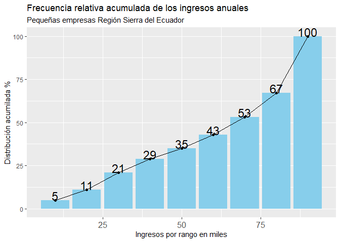

# RETO-QSCD
Reto Quiero Ser Científico de Datos

Este trabajo forma parte del desafío "Reto Quiero Ser Científico de Datos".
Sigue las instrucciones:

 

1. Realizar un gráfico de barras considerando las empresas de la región SIERRA

  
  
2. Realiza una regresión simple que explique el ingreso en función de la cantidad de empleados. Para efectos del ejercicio, se debe filtrar los casos cuyo ingreso y cantidad de empleados sea igual a 0. La regresión sólo debe construirse usando la provincia del Guayas. Se debe reportar los resultados, la interpretación de los coeficientes, las pruebas de autocorrelación, heterocedasticidad.

S
S

Resultados:
  
* Residuals:

  Min      1Q  Median      3Q     Max 
  
-439268 -193574  -76563  138947 4093811 
Coefficients:

* (Intercept)     3.541e+05  3.028e+03  116.94   <2e-16 ***

  Ingreso esperado cuando el número de empleados es 0.
  
 CANT..EMPLEADOS 1.852e+01  9.357e+00    1.98   0.0478 *  
 
Por cada aumento de empleado, se espera un aumento en el Ingreso de 18.52.
 

3. Realiza el mismo ejercicio del enunciado anterior, pero para pichincha. En este caso, sólo reporta los resultados y la explicación de los coeficiente.
 

Resultados:
 Coefficients:
    
* (Intercept)     352108.24    3068.54  114.75  < 2e-16 ***
  
Este valor representa el ingreso esperado cuando el número de empleados es 0.

* CANT..EMPLEADOS    483.54      68.68    7.04 2.12e-12 ***
  
Indica que por cada aumento de empleados, se espera un aumento de Ingresos de 483.54

Pruebas de Autocorrelación y Heterocedasticidad

* Durbin-Watson test
  
  data:  modelo
  
  DW = 1.5408, p-value < 2.2e-16
  
Presencia de correlación positiva

* studentized Breusch-Pagan test
  data:  modelo
  BP = 126.92, df = 1, p-value < 2.2e-16

